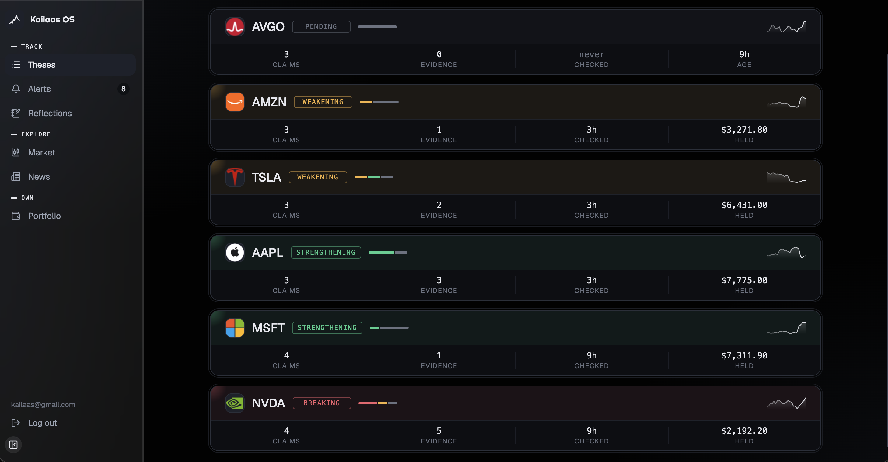
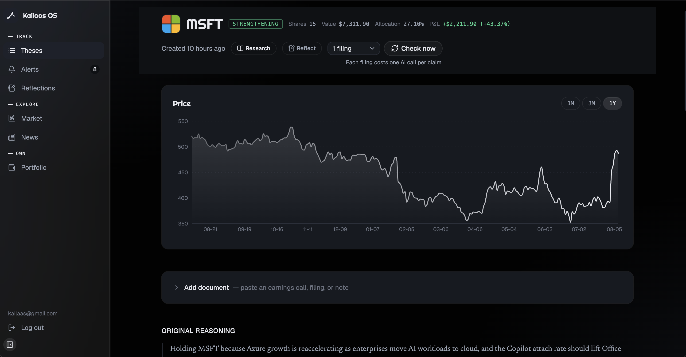
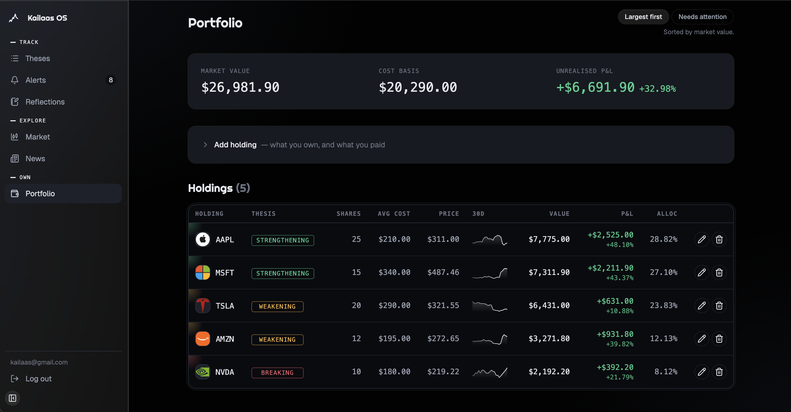
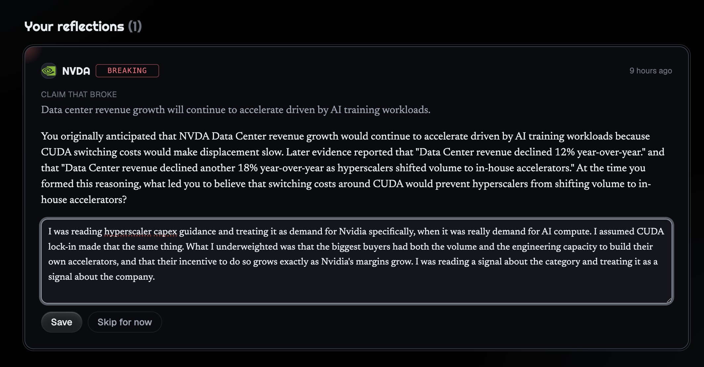

# Kailaas OS

**Remembers why you invested. Checks if it still holds.**

You write, in plain English, why you bought something. Kailaas OS turns that into
specific falsifiable claims, then checks those claims against real SEC filings —
and every verdict is backed by a quote it verifies exists in the source.

When a thesis breaks, it asks what you missed.

🔗 **[kailaas-os.vercel.app](https://kailaas-os.vercel.app)** · not investment advice — it reports status, never recommendations

---



*Six theses, five statuses. The engine that decides those statuses is plain code,
not a language model.*

---

## The idea

Most investing tools tell you what a stock did. None of them remember **why you
bought it** — so when the reasoning quietly stops being true, nothing tells you.

Kailaas OS tracks the reasoning:

| | |
|---|---|
| **1** | You write why you invested, in your own words |
| **2** | An LLM extracts 2–4 claims, each with an explicit proof and break condition |
| **3** | New filings are checked against every claim, with cited evidence |
| **4** | Status is computed by deterministic code — strengthening, weakening, breaking |
| **5** | When a core claim breaks, it asks you a specific question about your reasoning at the time |

Alerts fire only on a status *change*. Silence is the default.

---

## Three things worth noticing

### It cannot fabricate a quote

Every verdict must come with a verbatim quote. Before anything is saved, code
checks that quote appears in the passages the model was actually shown. If it
doesn't, the verdict is discarded — however confident it sounded.

"Never fabricates" isn't a prompt instruction here. It's enforced in code.

### Status is deterministic

No LLM decides whether your thesis is breaking. A weighted score over the
evidence log, run through an ordered threshold table:

```
score = Σ(confidence of supporting) − Σ(confidence of contradicting)
```

Same evidence, same answer, every time — and you can always explain why.

One consequence worth stating: a single contradiction at 98% confidence *won't*
break a claim backed by three supports. One bad quarter shouldn't erase a year
of evidence.

### Retrieval was measured, not assumed

Sending a 360,000-character 10-K to an LLM isn't viable, so passages are
retrieved per claim. Pure vector search ranked the decisive passage **#14 of 882
chunks** — and the app confidently reported *"no evidence"* on a filing that
mentioned gross margin thirteen times.

Nothing crashed. Nothing failed a test.

Adding BM25 and fusing the two rankings moved that passage to **#0**, and let
`k` drop from 20 to 8 — roughly **60% fewer tokens per claim, with better
recall.**

---



*The price line is a commodity. The markers on it are evidence from your own
filings — contradictions in red, status transitions labelled.*

---

## Architecture

Hexagonal — ports and adapters. Six ports, each drawn where an external
dependency was likely to change:

| Port | Adapters |
|---|---|
| `LLMProvider` | Gemini · Groq |
| `DocumentSource` | Paste · SEC EDGAR |
| `EvidenceRetriever` | Naive · Vector · **Hybrid** |
| `NewsSource` | Google News RSS |
| `PriceSource` | yfinance |

Three of those external services are unofficial and one has already started
refusing requests mid-project. Each swap has cost exactly one new file.

**Layers:** `api → services → domain`, with `domain/` holding pure logic — no
database, no network, no AI. That's what makes the status engine, chunking, BM25
and the P&L maths fully unit-testable.

**Retrieval:** sentence-aware chunking → local MiniLM embeddings → ChromaDB,
fused with a from-scratch BM25 implementation via reciprocal rank fusion.
Embeddings run on-device, so retrieval costs nothing.

---



*Position size next to thesis status. "Your largest holding has a breaking
thesis" is a fact worth surfacing. What to do about it is not the app's business.*

---

## Stack

**Backend** — Python · FastAPI · SQLAlchemy · Postgres · pytest
**Frontend** — TypeScript · React 19 · Vite · Tailwind · Recharts · Vitest
**AI/ML** — Gemini or Groq (swappable) · sentence-transformers · ChromaDB · BM25 (own implementation)
**Data** — SEC EDGAR · yfinance · Google News RSS
**Hosting** — Railway · Vercel

~380 tests. One paid API key; everything else is free or runs locally.

---



*Generated from the claim that broke and the evidence that broke it. The
question must quote material that actually exists, or it's rejected and retried.*

---

## Running it locally

```bash
# Backend
python -m venv venv && source venv/bin/activate
pip install -r requirements.txt
cp .env.example .env          # add GEMINI_API_KEY and SEC_USER_AGENT
uvicorn backend.main:app --reload

# Frontend
cd frontend && npm install && npm run dev
```

Defaults to SQLite locally; set `DATABASE_URL` for Postgres.
Set `LLM_PROVIDER=groq` to use Groq instead of Gemini.

---

## What it deliberately doesn't do

**No buy/sell recommendations.** Ever. It reports thesis status and behavioural
patterns. What to do with that is yours.

**No fabricated data.** A verdict without a verifiable quote is discarded. An
empty result is a real answer, not a failure.

**US-listed companies only** — it reads SEC filings, so NSE/BSE-listed companies
aren't covered.

**Three of five data sources are unofficial.** yfinance, Google News RSS and
Clearbit are published but not guaranteed. Each sits behind a port for that
reason.

**No real-time prices, brokerage import, or tax lots.** Backend complexity is
spent on thesis tracking; everything else is a clean interface over simple data.

---

## Status

Phases 1–3 complete, plus authentication, deployment, and supporting features.
Phase 4 (a yearly retrospective) needs months of accumulated history to say
anything honest. Phase 5 (an opt-in public thesis trail, ranked on prediction
accuracy rather than returns) is next.

Feedback welcome — especially on the retrieval work.
